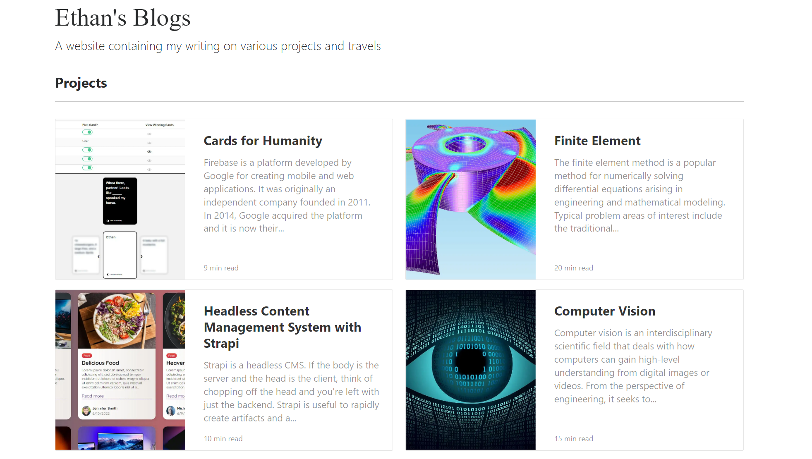

# gatsby-blogging

A blogging site created with Gatsby

[Check it out!](https://etuong.github.io/gatsby-blogging/)

Gatsby is a buzzword in the web development field that I have been hearing for a while and always wanted to explore. Specifically, I wanted to learn about static site generators. Historically, we have always had client-side rendering and server-side rendering and they each have pros and cons, I was particularly interested in learning how static-side generation was going to solve some of these problems.

The user experience on a SSG build is superb because all the HTML pages are all already generated. Gatsby takes templates, components, and data to generate static HTML pages in build time. JAMstack is a modern architecture for building websites and applications. Traditionally, we have CMS like Wordpress that requires a database to store content and there's also a presentation layer of template files that mix HTML with template tags. In this type of architecture, the frontend and backend are tightly coupled. Both the content and how it’s presented are part of the same code base (aka monolithic architecture). In a JAMstack architecture, these ends are decoupled. The frontend static resources (HTML, CSS, JS) are generated by Gatsby during the build process and the backend is any content API that returns a JSON or XML or even markdowns (which I use for this blogging site).

### Development and Deployment
To run the dev server, `yarn develop`
To build and deploy, first run `yarn build` to build the static files. Deploy this folder to your favorite web server.

### Blogging
Gatsby configuration is all set up for you. Just need to add markdown files in the `markdown` folder and retrieve with GraphQL.